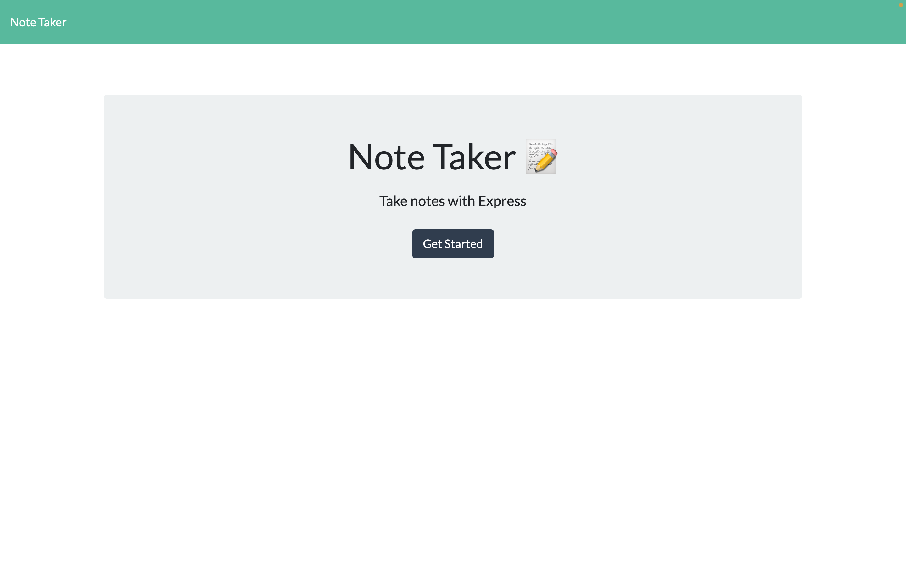
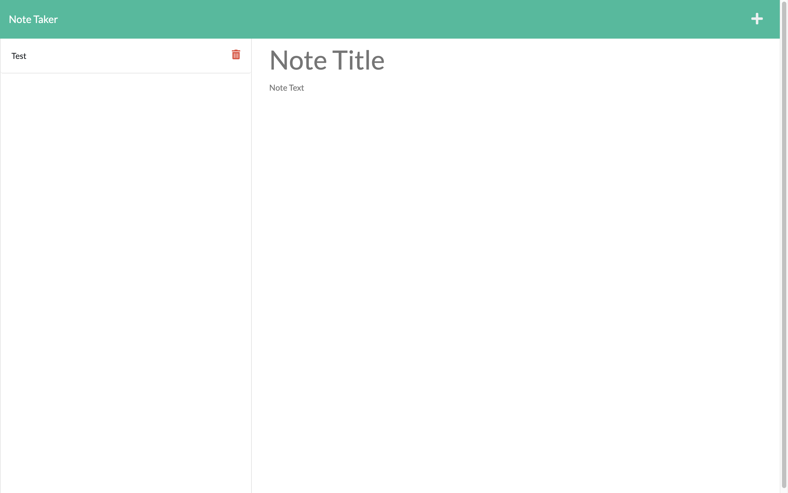
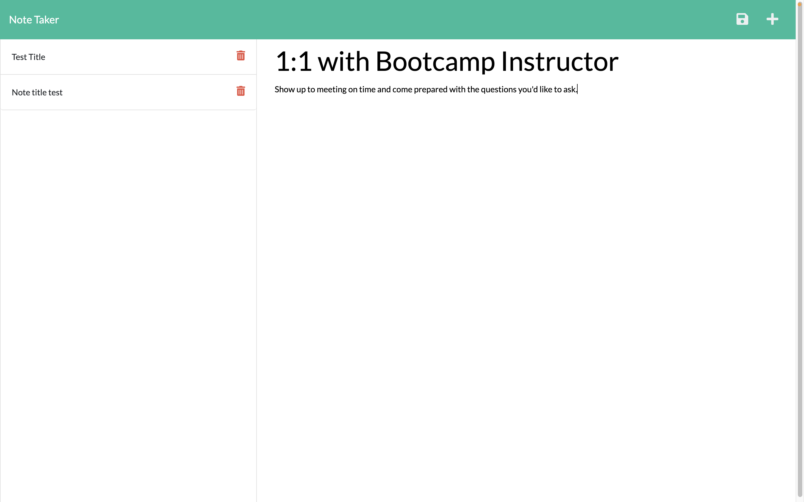
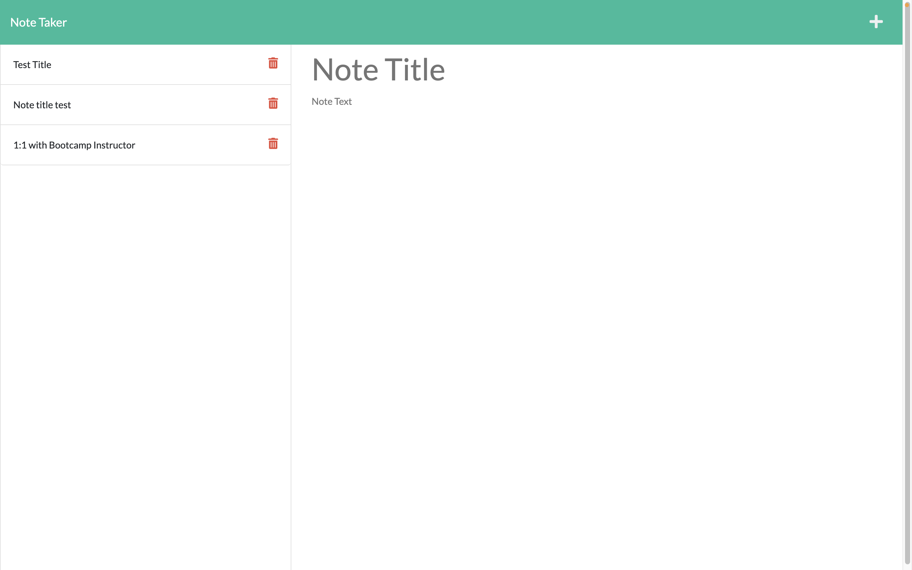
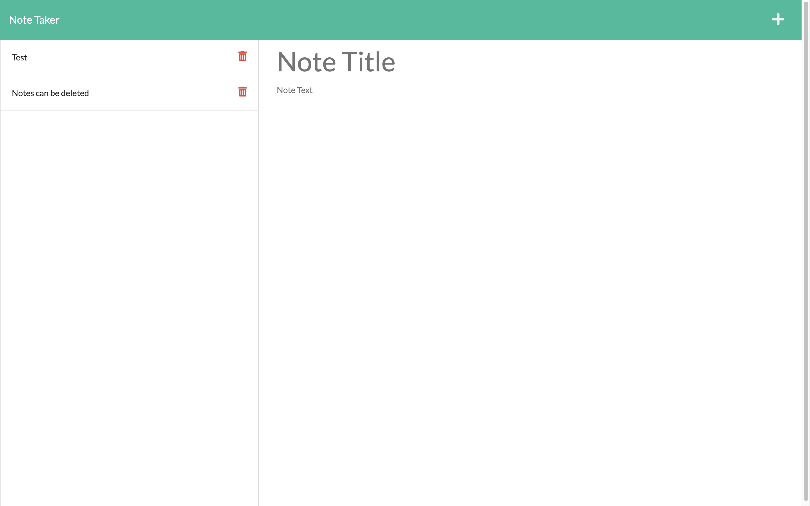

# Challenge Nine: Express.js - Note Taker

## Project Description

Challenge Nine required us to modify the starter code so that the Note Taker application can write and save a user's notes. The application uses the Express framework to handle different HTTP methods in an API route, allowing the user to send GET, POST, and DELETE requests to the server with a response returned to them. We then utilized Heroku to deploy the application. 

## Application Root Route

The following image shows the note taker application at '/' endpoint.

### Notes Route 

The following image shows the note taker application at '/notes' endpoint.

## Saving a Note

The following images shows the notes list before and after the user saves a note:

## Deleting a Note

The following images shows the notes list before and after the user deletes a note:

### Link to Github Repository
[https://github.com/jffsun/chall-nine-note-taker](https://github.com/jffsun/chall-nine-note-taker)

### Link to Heroku Application
[https://limitless-inlet-36929.herokuapp.com/](https://limitless-inlet-36929.herokuapp.com/)